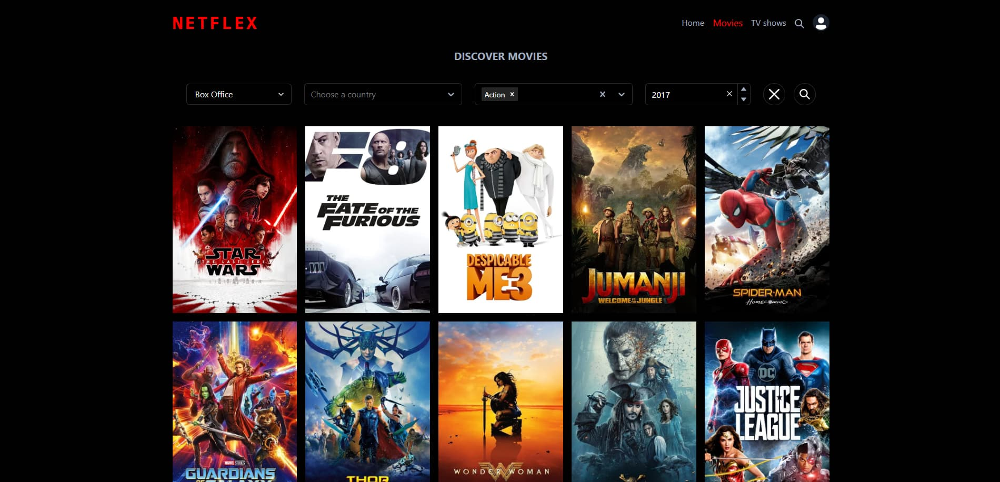
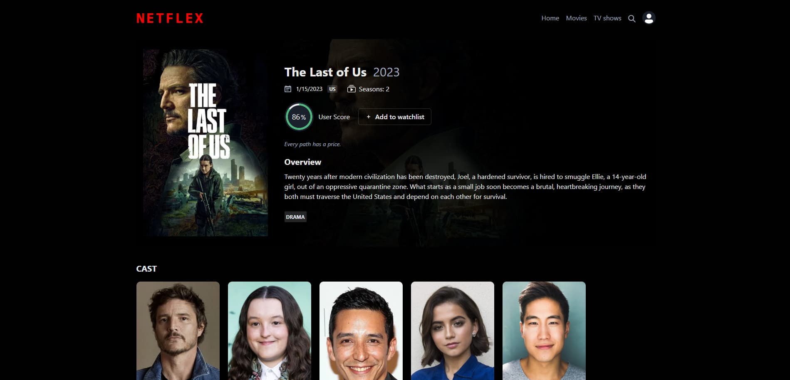
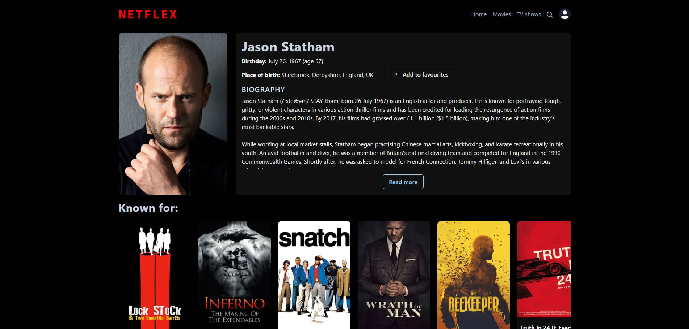
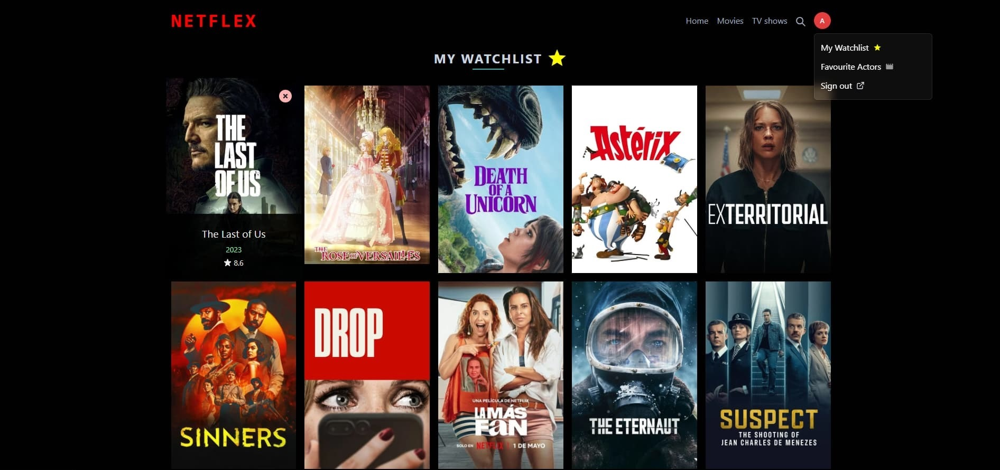
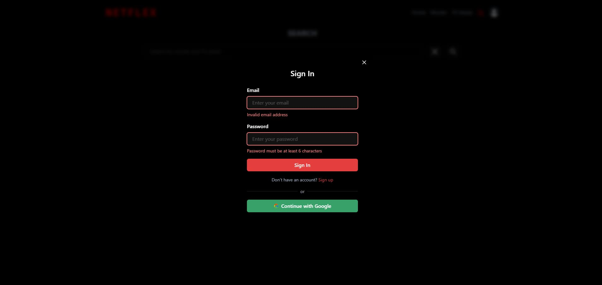
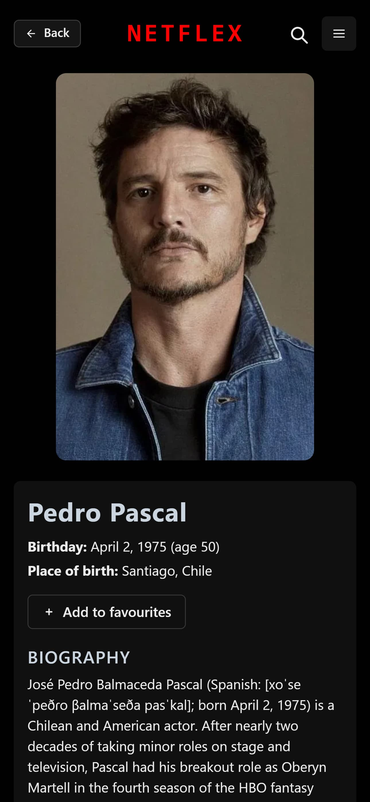
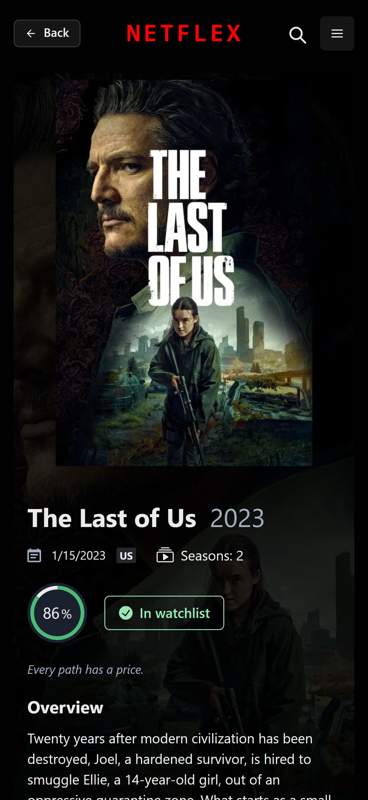
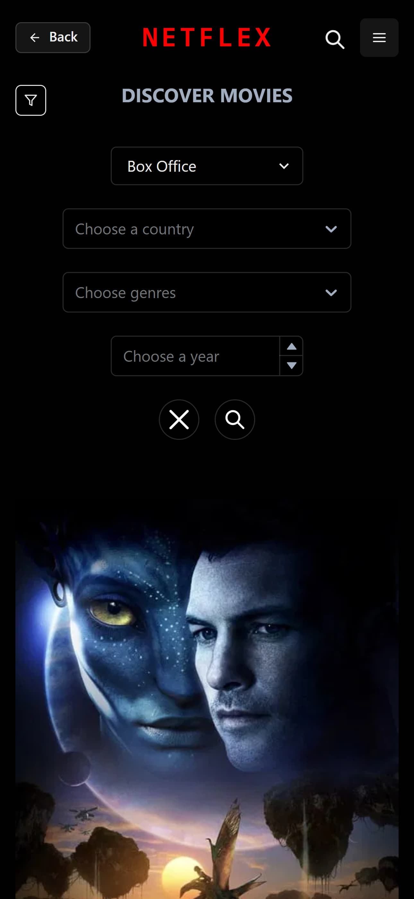

# 🎬 Netflex

A responsive Netflix-style app built with React and Chakra UI, featuring authentication, movie/actor browsing, favorites, and advanced filtering. All data is synced with Firebase.

---

## 🚀 Features

### 🔐 Authentication

- Sign up / Log in with **Firebase Authentication**
- After logging in:
  - Access **Favorites** section (movies and actors in separate tabs)
  - Favorites stored per user in **Firebase Firestore**

### 🎞️ Browse Movies & TV Shows

- Trending **Movies** and **TV Series** in separate tabs
- Each item has a **dedicated detail page** with extended info
- Full search and filter functionality:
  - Filter by genre, rating, year, type
- Pagination to efficiently browse large datasets

### ⭐ Favorites (Firebase-based)

- Add/remove favorites (movies and actors)
- Two separate tabs: **Favorite Movies** & **Favorite Actors**
- Favorites saved in Firestore and persist per user

### 👤 Actor Pages

- Clickable actor cards with personal detail pages
- View biography, movies, and more

### 🌐 Routing (React Router)

- Navigation between:
  - Home
  - Trending
  - Movies
  - TV Shows
  - Favorites
  - Actor and movie detail pages
  - Auth pages

### 💅 UI & UX

- Built with **Chakra UI**
- Mobile-first design
- Fully responsive on all screen sizes

---

## 🧰 Tech Stack

- ⚛️ React 19
- 🔁 React Router 7
- 🎨 Chakra UI
- 🔥 Firebase (Auth + Firestore)
- 🎬 TMDb API
- 🎯 React Select
- 🧰 Axios for API calls
- 🎨 React Icons

---

## 📸 Screenshots

### 💻 Desktop View







### 📱 Mobile View

| Actor Mobile                                      | Description Mobile                                      | Filters Mobile                                      | Menu Mobile                                      |
| ------------------------------------------------- | ------------------------------------------------------- | --------------------------------------------------- | ------------------------------------------------ |
|  |  |  |  |

## 📦 Installation

```bash
git clone https://github.com/alexcardx/movie-app.git
cd movie-app
npm install
npm start
```

## ⚙️ Environment Variables

Create a `.env` file in the root directory and add the following variables:

```env
VITE_MOVIE_API_KEY=your_tmdb_api_key
VITE_FIREBASE_API_KEY=your_firebase_config
VITE_FIREBASE_AUTH_DOMAIN=your_firebase_config
VITE_FIREBASE_PROJECT_ID=your_firebase_config
VITE_FIREBASE_STORAGE_BUCKET=your_firebase_config
VITE_FIREBASE_MESSAGING_SENDER_ID=your_firebase_config
VITE_FIREBASE_APP_ID=your_firebase_config
```
